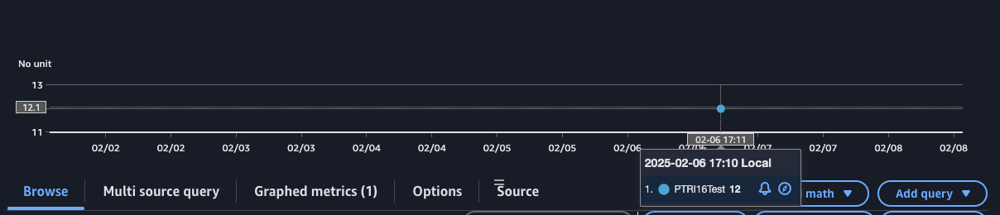
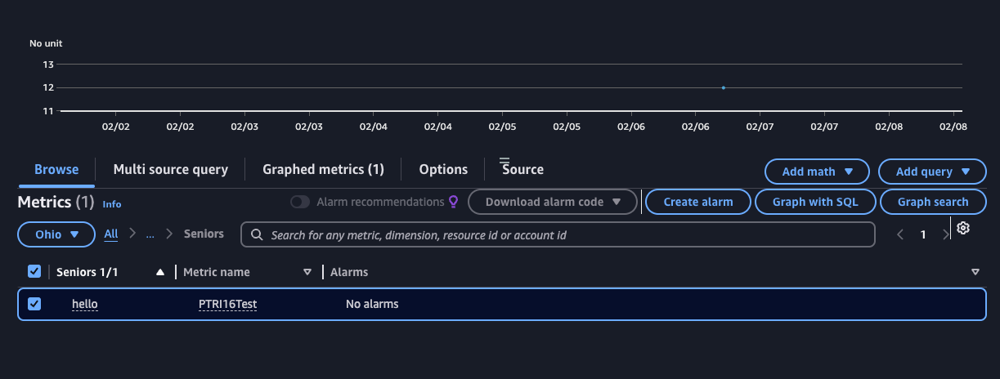
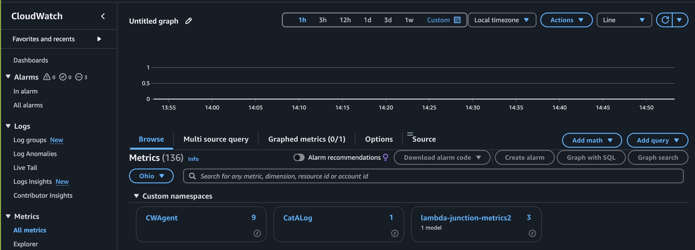
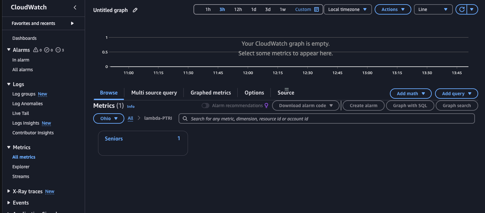
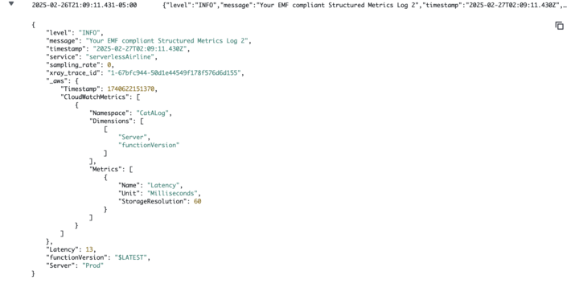

 <p align="center">
  
  </p>

# Welcome to Cat-A-Log!
This npm package helps you integrate AWS CloudWatch with AWS Embedded Metric Format (EMF) Logs and publish them to Cloudwatch using AWS Lambda Powertools. EMF formatting will allow for chosen metrics to be automatically visualized in Cloudwatch metrics for centralized observability of your application KPIs. Read Our Medium article to learn more about the Cat-A-Log story:
<a href="https://medium.com/cat-a-log/adding-embedded-metric-formatting-to-aws-lambda-logs-for-simplified-debugging-ee388fdfd3db" target="_blank">Easily Automate Custom Metrics in CloudWatch with EMF in Lambda</a>

## Table of Contents
- [Cat-A-Log](#why-use-cat-a-log)
- [EMF](#about-embedded-metric-formatting-emf)
- [Instructions](#instructions)
- [How to Contribute](#open-source-contributions)
- [Contributors](#contributor-information)


  <!-- <p align="center">
  
  </p> -->

## Why use Cat-A-Log?
Why use a washing machine when you can do them by hand? Because it saves you time and makes your job way easier! Leveraging AWS Lambda Powertools we can use the cat-a-log function to invoke and format logs into AWS Embedded Metric Format. By publishing these logs to AWS Cloudwatch, we are able to provide engineers with automatic metric visualization to make the process of debugging logs much more efficient. Cat-a-log utilizes a cache to make efficient work of sending logs to Cloudwatch.

## About Embedded Metric Formatting (EMF):
EMF is a JSON specification that enables CloudWatch Logs to automatically extract embedded metric values from structured log events. It simplifies real-time monitoring by reducing complexity and cost for applications needing custom metrics and structured logging. For more information please visit the following link:
<a href="https://docs.aws.amazon.com/AmazonCloudWatch/latest/monitoring/CloudWatch_Embedded_Metric_Format_Specification.html" target="_blank">AWS Documentation on EMF Formatting</a>


## Instructions
**Prerequisites:**
Your chosen Integrated Development Environment (i.e. VS Code) must already be connected to AWS Lambda. For more guidance on setting up AWS Lambda we recommend following this helpful tutorial from AWS: <a href="https://docs.aws.amazon.com/serverless-application-model/latest/developerguide/serverless-getting-started-hello-world.html" target="_blank">Deploy Hello World Application with AWS SAM</a>

**Installation:**
1. Install our package using the command `npm install cat-a-logs` then import the functions into your js file that connects to AWS Lambda `import { deployCatalog, catalog } from "cat-a-logs/index.js";` Check out Cat-A-Log on npm using the attached link:
<a href="https://www.npmjs.com/package/cat-a-logs?activeTab=readme" target="_blank">Cat-A-Log</a>

2. Now enter your arguments into the catalog function! Let's go through each parameter one at a time and see what this looks like. First let's take a look at the function definition:

      ```
      function catalog(
        trackedVariable: number | Array<number>,
        metricName: string,
        metricNamespace: string = "CatALog-Default-Metrics",
        metricUnitLabel: string = "None",
        CustomerDefinedDimension: { [key: string]: string } = {},
        resolution: 1 | 60 = 60,
        deploy: boolean = false)
      ```

    - **trackedVariable**: This variable represents the numerical value (or an Array containing a maximum of 100 numerical values) of the metric that will appear under the category "Custom namespace" in Cloudwatch Metrics. This is AWS Cloudwatch>Metrics>All metrics>Custom namespaces(ex. CatALog)>Dimensions(ex. Server, functionVersion)

    <p align="center">
    
    </p>


    - **metricName**: This is a unique label of the tracked variable that will be reflected inside AWS Cloudwatch. Must be written as a `string`. 
      In the below image this corresponds to `Latency` --> AWS Cloudwatch>Metrics>All metrics>Custom namespaces

    <p align="center">
    
    </p>

    - **metricNamespace**: This will be your "Custom namespace" in AWS Cloudwatch>Metrics>All metrics>Custom namespaces. In the below image this is represented by CatALog

    <p align="center">
    
    </p>

    - **metricUnitLabel**: The explicit unit that Cloudwatch uses for EMF Configuration. Please note - must be one of the following as a `string`:
      - Seconds | Microseconds | Milliseconds | Bytes | Kilobytes | Megabytes | Gigabytes | Terabytes | Bits | Kilobits | Megabits | Gigabits | Terabits | Percent | Count | Bytes/Second | Kilobytes/Second | Megabytes/Second | Gigabytes/Second | Terabytes/Second | Bits/Second | Kilobits/Second | Megabits/Second | Gigabits/Second | Terabits/Second | Count/Second | None

      - To read more about Metric Datum see this <a href="https://docs.aws.amazon.com/AmazonCloudWatch/latest/APIReference/API_MetricDatum.html" target="_blank">link</a>
    - **CustomerDefinedDimension**: This is an object - `{'functionVersion': '$LATEST', 'Server': 'Prod'}` functionVersion & Server is the dimension label/key - when you click on it see the value `$LATEST` and `Prod` is the value of the dimension

        - The key will show up in AWS Cloudwatch as below:

          <p align="center">
          
          </p>

        - If the user clicks on the Server, functionVersion Dimension then you will see the value - in this example `$LATEST` & `Prod` reflected as below:

          <p align="center">
          
          </p>


    - **resolution**: This parameter can only be set to the numericalthe numerical val.uA of 1 OR 60 , theically set to  is setdefault value to 60. If you would like to learn more about High Resolution Metrics please follow the attached <a href= "https://docs.aws.amazon.com/AmazonCloudWatch/latest/monitoring/publishingMetrics.html#high-resolution-metrics" target="_blank">link</a>
    - **deploy**: Automatically set to false. The final catalog call you make has to switch deploy flag to true. Failure to do so will cause the cache to grow without bound and use up memory

3. Start Building your Embedded Metric Formatted Logs. Call `catalog` as many times as needed. 
<!-- You can also `console.log(cache)` at any time to see your EMF formatted logs being built in real time.  -->


4. ON the very last function call - it is important to change the deploy parameter to `true`. 
     - Alternative approach is to deploy your Lambda function with the `deployCatalog()` function call. This will automatically publish to CloudWatch without the need to use the entire arguments required in Cat-A-Log. Place `deployCatalog()` after you last catalog function call.

5. Deploy your code with AWS SAM. This will place the file in AWS Lambda waiting for invocation. If you would like to learn more about deploying with SAM please follow the attached
          <a href= "https://docs.aws.amazon.com/lambda/latest/dg/testing-functions.html" target="_blank">link</a>
6. Invoke your AWS Lambda Function

7. See your metrics and structured in CloudWatch! 
 <p align="center">
          
          </p>
          
## Open Source Contributions:
We are actively looking for contributors to our project! In order to get started we ask that you follow the below guidelines:

  - Clone our Repository from GitHub <a href="https://github.com/oslabs-beta/cat-a-log" target="_blank">here</a> 
  - Make a Feature Branch 
  - Make your contributions
  - Push to your Feature Branch in GitHub
  - Make a Pull Request to our Repository!


| AWS MicroService Support                                                              | Status    |
|---------------------------------------------------------------------------------------|-----------|
| Lambda                                                                                 | ✅        |
| EC2                                                                                   | ⏳        |


|Feature                                                                                |Status     |
|---------------------------------------------------------------------------------------|-----------|
| TypeScript                                                                            | ✅        |
| Embedded Metric Format Object Caching                                                 | ✅        |
| Winston                                                                                | ⏳        |
| Adding front end for Cat-A-Log                                                        | 🙏🏻        |


- ✅ = Ready to use
- ⏳ = In progress
- 🙏🏻 = Looking for contributors

## License Information:
This project is licensed under the MIT License -  see the [LICENSE](LICENSE) file for details


## Contributor Information:
 <table>
  <tr>
    <td align="center">
      
      <br />
      <sub><b>Clara Regula</b></sub>
      <br />
      <a href="http://www.linkedin.com/in/clara-regula">🖇️</a>
      <a href="https://github.com/clararegula">🐙</a>
    </td>
    <td align="center">
      
      <br />
      <sub><b>Brian Anderson</b></sub>
      <br />
      <a href="https://www.linkedin.com/in/brian-anderson-24370630/">🖇️</a>
      <a href="https://github.com/brianmichaelanderson">🐙</a>
    </td>
    <td align="center">
      
      <br />
      <sub><b>Harris Awan</b></sub>
      <br />
      <a href="http://www.linkedin.com/in/harrawan123/">🖇️</a>
      <a href="https://github.com/HarrAwa">🐙</a>
    </td>
     <td align="center">
      
      <br />
      <sub><b>Curran Lee</b></sub>
      <br />
      <a href="https://www.linkedin.com/in/curranjlee/">🖇️</a>
      <a href="https://github.com/CJLee5">🐙</a>
    <td align="center">
      
      <br />
      <sub><b>Jacob Alexander</b></sub>
      <br />
      <a href="https://www.linkedin.com/in/jacoblanealexander/">🖇️</a>
      <a href="https://github.com/jacob-jpg1">🐙</a>
    </td>
</table>


- 🖇️ = LinkedIn
- 🐙 = Github