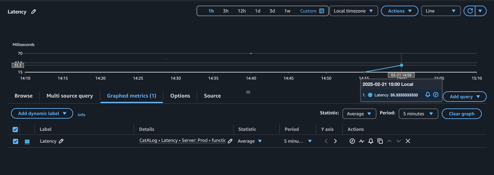
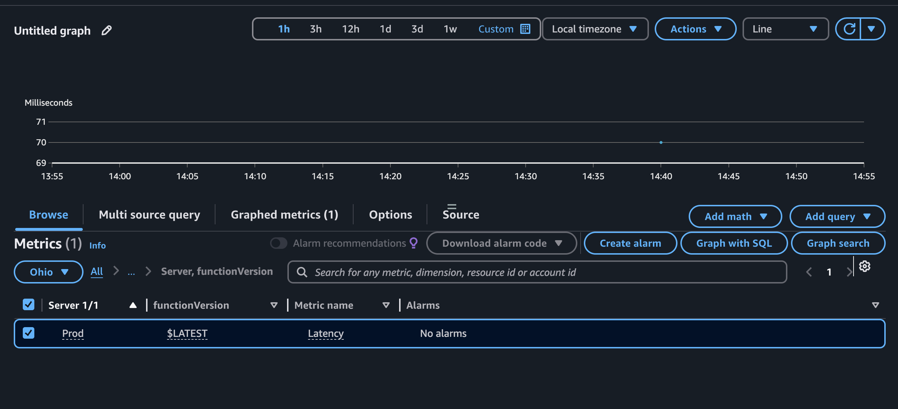
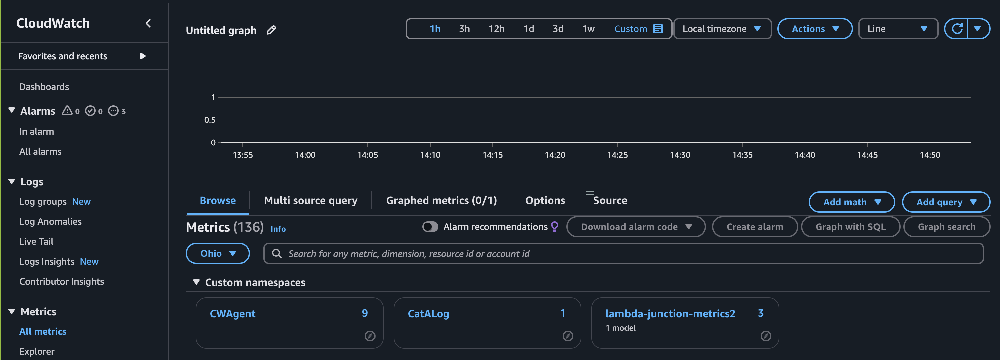
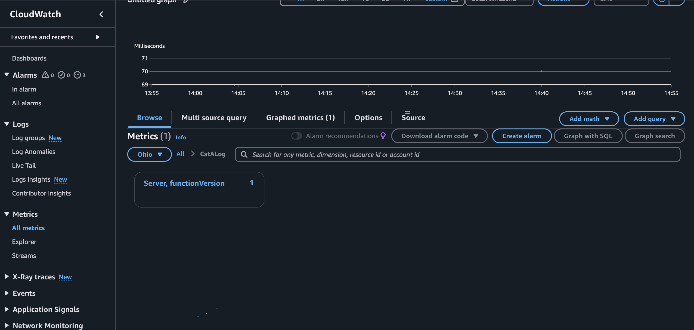

# Welcome to Cat-A-Log!
This npm package will help you create AWS Embedded Metric Format Logs and publish them to AWS Cloudwatch using AWS Lambda Powertools. EMF formatting will allow for chosen metrics to be automatically visualized in Cloudwatch metrics  for simplier log debugging.

  <p align="center">
  
  </p>


## About Embedded Metric Formatting (EMF):
This is a JSON specification to communicate with Cloudwatch Logs to automatically extract values embedded in the structured log events. EMF is especially great for applications that make logs and need custom metrics without more complexity or cost. For more information please visit the following link:
<a href="https://docs.aws.amazon.com/AmazonCloudWatch/latest/monitoring/CloudWatch_Embedded_Metric_Format_Specification.html" target="_blank">AWS Documentation on EMF Formatting</a>

## Why use Cat-A-Log?
Why use a washing machine when you can do them by hand? Because it saves you time and makes your job way easier! Leveraging AWS Lambda Powertools we can use the cat-a-log function to invoke and format logs into AWS Embedded Metric Format. By publishing these logs to AWS Cloudwatch, we are able to provide engineers with automatic metric visulaization to make the process of debugging logs much more efficient. Cat-a-log utilizies a cache to make effcient work of sending logs to Cloudwatch.


## Instructions
**Prerequites:**
Your chosen Integated Development Environment (i.e. VS Code) must already be be connected to AWS Lambda. For more guidence on setting up AWS Lambda we recommend following this helpful tutorial from AWS: <a href="https://docs.aws.amazon.com/serverless-application-model/latest/developerguide/serverless-getting-started-hello-world.html" target="_blank">Deploy Hello World Application with AWS SAM</a>

**Installation:**
1. Install our package using the command `npm install cat-a-logs` then import the function and cache into your js file that connects to AWS Lambda `import { cache, catalog } from "cat-a-logs/index.js";` Check out Cat-A-Log on npm using the attached link:
<a href="https://www.npmjs.com/package/cat-a-logs?activeTab=readme" target="_blank">Cat-A-Log</a>

2. Now enter your arguments into the catalog function! Lets go through each argument one at a time and see what this looks like. First Lets take a look at the function definition:

      ```
      function catalog(
        trackedVariable: number | Array<number>,
        metricName: string,
        metricNamespace: string,
        metricUnitLabel: string = "None",
        CustomerDefinedDimension: { [key: string]: string } = {},
        resolution: 1 | 60 = 60,
        deploy: boolean = false)
      ```

    - **trackedVariable**: This variable represents a the numerical value of the metric that will appear under the category "Custom namespace" in Cloudwatch Metrics. Custom metric category/namespace/AWS Namespace. This is AWS Cloudwatch>Metrics>All metrics>Custom namespaces(ex. lambda-PTRI)>Dimensions(ex. Seniors)

    <p align="center">
    
    </p>


    - **metricName**: This is a unique label of the tracked variable that will be reflected inside AWS Cloudwatch. Must be written as a `string` 
      In the below image this corresponds to PTRI16Test --> AWS Cloudwatch>Metrics>All metrics>Custom namespaces

    <p align="center">
    
    </p>

    - **metricNamespace**: This will be your "Custom namespace" in AWS Cloudwatch>Metrics>All metrics>Custom namespaces. In below image this is represented by lamdba-PTRI

    <p align="center">
    
    </p>

    - **metricUnitLabel**: Explict Unit that Cloudwatch uses for EMF Configuration. Please note - must be one of the following as a `string`:
      - Seconds | Microseconds | Milliseconds | Bytes | Kilobytes | Megabytes | Gigabytes | Terabytes | Bits | Kilobits | Megabits | Gigabits | Terabits | Percent | Count | Bytes/Second | Kilobytes/Second | Megabytes/Second | Gigabytes/Second | Terabytes/Second | Bits/Second | Kilobits/Second | Megabits/Second | Gigabits/Second | Terabits/Second | Count/Second | None

      - To read more about Metric Datum see this <a href="https://docs.aws.amazon.com/AmazonCloudWatch/latest/APIReference/API_MetricDatum.html" target="_blank">link</a>
    - **CustomerDefinedDimension**: This is an object - `{ Senior: 'hello'}` Senior is the dimension label/key - when you click on it see the value hello and hello is the value of the dimension

        - The key will show up in AWS Cloudwatch as below:

          <p align="center">
          
          </p>

        - If the user clicks on the Seniors Dimension then you will see the value - in this example "hello" reflected as below:

          <p align="center">
          
          </p>


    - **resolution**: This is automatically set to default value to 60. If you would like to learn more about High Resolution Metrics please follow the attached <a href= "https://docs.aws.amazon.com/AmazonCloudWatch/latest/monitoring/publishingMetrics.html#high-resolution-metrics" target="_blank">link</a>
    - **deploy**: automatically set to false. The final catalog call you make has to switch deploy flag to true. Failure to do so will cause the cache to grow without bound and use up memory

3. Start Building your Embedded Metric Formatted Logs. Call catalog as many times as needed. 
<!-- You can also `console.log(cache)` at any time to see your EMF formatted logs being built in real time.  -->

4. ON the very last function call - it is important to change the deploy parameter to `true`. 

5. Deploy your code with AWS SAM. This will place the file in AWS Lambda waiting for invokation.

6. Invoke your AWS Lamda Function

7. See your metrics and structured in CloudWatch! 

## Open Source Contributions:
We are actively looking for contributors to our project! In order to get started we ask that you follow the below guidelines:

  - Clone our Repository from GitHub <a href="https://github.com/oslabs-beta/cat-a-log" target="_blank">here</a> 
  - Make a Feature Branch 
  - Make your contributions
  - Push to your Feature Branch in GitHub
  - Make a Pull Request to our Repository!


| AWS MicroService Support                                                              | Status    |
|---------------------------------------------------------------------------------------|-----------|
| Lamda                                                                                 | ✅        |
| EC2                                                                                   | ⏳        |


|Feature                                                                                |Status     |
|---------------------------------------------------------------------------------------|-----------|
| TypeScript                                                                            | ✅        |
| Embedded Metric Format Object Caching                                                 | ✅        |
| Winson                                                                                | ⏳        |
| Adding front end for Cat-A-Log                                                        | 🙏🏻        |


- ✅ = Ready to use
- ⏳ = In progress
- 🙏🏻 = Looking for contributors

## License Information:
Put License Information Here


## Contributor Information:
 <table>
  <tr>
    <td align="center">
      
      <br />
      <sub><b>Clara Regula</b></sub>
      <br />
      <a href="https://www.linkedin.com/search/results/all/?fetchDeterministicClustersOnly=false&heroEntityKey=urn%3Ali%3Afsd_profile%3AACoAABKxIR0BLV8OyI1zzVgyL3KR2K0ePJ7tQS4&keywords=allison%20pratt&origin=RICH_QUERY_SUGGESTION&position=0&searchId=81cd2d60-188d-44c9-99ce-acff05157dc7&sid=~xo">🖇️</a>
      <a href="https://github.com/clararegula">🐙</a>
    </td>
    <td align="center">
      
      <br />
      <sub><b>Brian Anderson</b></sub>
      <br />
      <a href="https://www.linkedin.com/search/results/all/?fetchDeterministicClustersOnly=false&heroEntityKey=urn%3Ali%3Afsd_profile%3AACoAAA4wGg4B94KTig7u7BXG-d_hbiDT6_INpB8&keywords=katrina%20villanueva&origin=RICH_QUERY_SUGGESTION&position=0&searchId=61fd3f0e-8949-4718-a772-d24f2617e726&sid=Zr~">🖇️</a>
      <a href="https://github.com/brianmichaelanderson">🐙</a>
    </td>
    <td align="center">
      
      <br />
      <sub><b>Curran Lee</b></sub>
      <br />
      <a href="http://www.philliptroutman.info">💻</a>
      <a href="https://www.linkedin.com/in/phillip-troutman/">🖇️</a>
      <a href="https://github.com/troutman21">🐙</a>
    </td>
     <td align="center">
      
      <br />
      <sub><b>Natalie Klein</b></sub>
      <br />
      <a href="https://www.linkedin.com/search/results/all/?fetchDeterministicClustersOnly=false&heroEntityKey=urn%3Ali%3Afsd_profile%3AACoAABxBUMYBYh3jl6z8XMVs4D1VjdqU-oastdc&keywords=natalie%20klein&origin=RICH_QUERY_SUGGESTION&position=0&searchId=7ca29d7e-56b5-4dce-a2a1-f9d9e5594052&sid=XY8">🖇️</a>
      <a href="https://github.com/natalie-klein">🐙</a>
    <td align="center">
      
      <br />
      <sub><b>Mike Masatsugu</b></sub>
      <br />
      <a href="https://www.linkedin.com/search/results/all/?fetchDeterministicClustersOnly=false&heroEntityKey=urn%3Ali%3Afsd_profile%3AACoAAAnv9wwBJJ9SgtkuND-IT1hQIl6hVS50AJ4&keywords=mike%20masatsugu&origin=RICH_QUERY_SUGGESTION&position=0&searchId=51ea03d4-28fa-431c-b97c-df470d78d606&sid=~Ov">🖇️</a>
      <a href="https://github.com/mikemasatsugu">🐙</a>
    </td>
</table>


- 🖇️ = LinkedIn
- 🐙 = Github
  
## Notes to Self:
**Structure of the files:**

`index.ts` is compiled to `index.js`. Important to compile `.ts` file to es6 js syntax using the `tsc —target es6 (filepath)` command
`app.mjs ` is a "pathway" to our lambda function. Here is where we will import catalog function and use it to involke our lambda function

index.ts lines 25-30 is checking to see if the value "level" || "message" || "sampling_rate" || "service" || "timestamp" ||"xray_trace_id"

logger.info gives you some information level is key and value is info


if you write name that it will overwrite the keys 

**Tech Challenges**
Spent 3 days dealing with inconsistencies of ES6/CommonJS in our code before compiling .js in ES6

**To DO LIST ITEMS**
- How can the user visaulize the cache growing in real time?
- Creating more professional scrreenshots for the ReadMe - to replace the current ReadMe screenshots
- Add License Information
